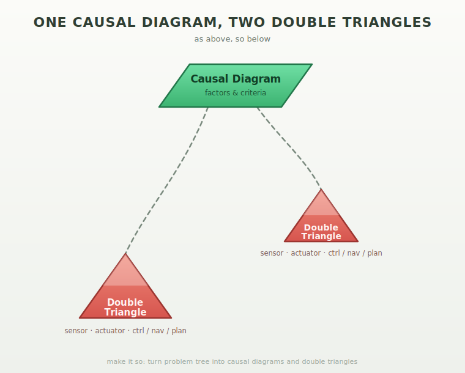

# Green



## Getting started with causal diagrams and double triangles

1. Start with a problem you want solved, written as a short problem tree: the main complaint at the top, its causes branching below.
2. Open six_dots (`python six_dots.py`), press `q`, and type the name of your problem tree file.
3. The tool's goal is to turn that tree into two things: a causal diagram (the *why*) and one or more double triangles (the *do*).
4. The causal diagram holds factors and criteria: a factor is a possible cause from your tree, and a criterion is a measurable threshold that tells you when that factor is really the problem.
5. Write your criteria so they can be checked — "more than 4 items waiting" works, "things feel slow" does not.
6. A double triangle is a small action loop: a sensor that measures, an actuator that acts, and control/plan/nav rows that run the loop.
7. Build one with `python load_double_triangle.py`: type transforms like `lux -> power`, or press `k` to pick quarks by number, then `l` to save it as `doubletriangle1` through `9`.
8. Each transform is one wire: "when the left side changes, drive the right side" — the sensor reads the left side, the actuator pushes the right side.
9. When a criterion in the causal diagram trips, it points at one factor, and that factor tells you which transform in the double triangle should fire.
10. Browse everything in six_dots with the arrow keys and digits 1–9, press Enter to view a file — and remember the sensor can be a light meter or a survey, and the actuator a motor or a person: the same loop works for machines and organizations alike.

## six_dots.py

A navigation/inspection dashboard for a self-organizing problem-solving system. The goal: turn a problem tree into causal diagrams and double triangles.

The six dots are the system's components:

1. **Orchestrator** — the coordinator; knows which causal diagram connects to which double triangle.
2. **Causal diagram** — holds factors and criteria (the *analysis* of a problem: what causes what).
3. **Double triangle** — an executable unit: a sensor, an actuator, control/nav/plan, and transforms (built with `load_double_triangle.py`). Essentially a small control loop that can act on the world.
4. **Bus** — picks up compressed sentences from the orchestrator and distributes information between components.
5. **Log** — the shared record (the log.csv record format the CSVs use).
6. **Do** — holds 9 functions that map onto `template_program.py`; the part that actually executes.

The intended pipeline: gather a *cluster* of problems → convert the cluster into a *problem tree* → convert the tree into *causal diagrams* (understanding) and *double triangles* (action) → "make it so". The same structure works for both technical and organizational problems — the actuator can be a motor or a person/team.

Controls: arrow keys select a component, digits 1–9 pick a numbered instance (e.g. `doubletriangle3`), Enter loads its CSV from `sixd/`, and `q` opens a form that takes a problem-tree file as input for the conversion.

A browser version is available in `six_dots.html`. Serve it locally (`python -m http.server`) and open http://localhost:8000/six_dots.html.

### Run

```
python six_dots.py
```

## glasses.py

glasses.py can start two different programs. They are the culmination of a year's work on AI.

A pygame launcher shaped like a pair of glasses.

The glasses image is displayed as the background. Two clickable file links are placed inside the lens areas:

- **six_dots.py** — left lens
- **load_double_triangle.py** — right lens

Clicking a link launches it with Python. Links highlight in red on hover.

### Requirements

- Python 3
- pygame (`pip install pygame`)

### Run

```
python glasses.py
```

## load_double_triangle.py

A CLI tool for building a double triangle CSV file (`sixd/doubletriangle1.csv`) in the log.csv record format.

Enter transforms one by one. Type `l` to save, `q` to quit.

Each transform is written as a row with `c` in e0, `transform` in e1, the left side in e2, and the right side in e3. Five fixed rows are always appended: `sensor`, `actuator`, `control`, `plan`, and `nav`.

Input shorthand: `lux power` is treated as `lux -> power`.

Quarks from `numbered quarks.csv` can be referenced by number: `k` lists all quarks, `k N M` adds a transform from quark N to quark M (e.g. `k 1 5` adds `container -> radiation`).

### Run

```
python load_double_triangle.py
```

## From double triangle to Raspberry Pi program

A double triangle CSV (e.g. `sixd/doubletriangle1.csv`: lux→power, force→speed) can become a running Raspberry Pi program without writing program logic by hand. The CSV is not data, it's a wiring diagram: each row tells a generic runtime what to connect, and the quark names are the plugs.

1. **A driver catalog maps quark names to hardware.** One small Python library on the Pi where every quark name that can appear in a transform has a driver: `lux` → BH1750 light sensor on I2C, `force` → force-sensitive resistor on an MCP3008 ADC, `power` → PWM duty cycle on a GPIO pin, `speed` → motor driver (L298N). Written once, reused by every double triangle.

2. **Each `transform` row becomes one wire.** `c;transform;lux;power` reads as: "the lux reading continuously drives the power output." A bright room dims an LED. `force;speed` means: squeeze the FSR harder, motor spins faster. Every transform starts as the same normalized linear map (input range → output range), only the endpoints differ.

3. **The five fixed rows are the skeleton of the program, not features.**
   - `sensor` → the read phase of the loop (poll all left-side quarks)
   - `actuator` → the write phase (push all right-side quarks)
   - `control` → the loop itself, say 10 Hz, optionally with a setpoint/PID per wire
   - `plan` → a sequence of setpoints over time ("dim to 20% after 22:00")
   - `nav` → a tiny state machine that switches between plans (day mode / night mode)

4. **The program is then ~50 lines and never changes.** It parses `doubletriangleN.csv`, looks up each quark in the driver catalog, builds the wire list, and runs the control loop. Want different behavior? Don't edit Python — build a new double triangle with `load_double_triangle.py` and point the Pi at it. The `q` in the sensor row could even mean "this triangle queries its sensor remotely," letting one Pi sense and another actuate over the bus.

5. **The orchestrator closes the loop.** Since six_dots knows which causal diagram connects to which double triangle, a problem tree like "plant dries out" → causal diagram → `soil_moisture -> water_pump` transform → the Pi greenhouse waters itself. That's the "make it so" path, ending in actual GPIO pulses.

The punchline: the Pi runs one permanent interpreter, and the double triangle CSVs become the *programs* — swappable behavior files a non-programmer can author by picking quark numbers.

## A causal diagram for a non-technical application

A causal diagram holds factors and criteria (see `sixd/dotexplain.csv`). Example: **a volunteer-retention dashboard for a local club** (sports club, choir, scouting group — any organization that bleeds volunteers).

The mapping:

- **Factors** are the causes people quit, taken straight from a problem tree: "feels unappreciated", "tasks unclear", "meetings too long", "conflict with board", "no say in decisions". The quark list already speaks this language — `group`, `conflict`, `own`, `reward`, `val`, `organization`, `dominate` are organizational quarks, not technical ones.

- **Criteria** are the measurable thresholds that make the soft stuff hard: "fewer than 2 thank-yous per month", "more than 3 hours of meetings per week", "0 decisions influenced this quarter". Each factor row gets a criterion row next to it. That's the entire trick: the causal diagram forces vague complaints into checkable statements.

- **The double triangle then runs the social control loop.** Sensor = a 3-question monthly survey (or just counting who shows up). Actuator = a person: the board member who must act when a criterion trips. Transforms like `conflict -> group` ("when conflict rises, schedule a group session") or `activity -> reward` ("logged hours trigger a thank-you"). Control = the monthly board meeting, plan = the season program, nav = switching between "recruiting mode" and "retention mode".

The point this demonstrates: the same six-dots pipeline — problem tree → causal diagram → double triangle — works when the sensor is a survey instead of a lux meter and the actuator is a chairperson instead of a PWM pin. One generic tool for technical *and* organizational problems.

## A double triangle for a non-technical application

`sixd/doubletriangle6.csv` holds five transforms: `effort -> location`, `tool -> compress`, `transaction -> reward`, `energy -> organization`, `activity -> organization`. Read organizationally, this is **a community repair café** — a monthly event where volunteers fix visitors' broken items.

The five wires:

- **`effort -> location`** — route volunteer effort to where the queue is. If the bicycle station is backed up and the electronics table is idle, effort moves there. Where you put effort *is* a location decision.

- **`tool -> compress`** — the right tool compresses the job. A soldering station turns a 40-minute fiddle into a 5-minute fix. Investing in tools is investing in shorter queues.

- **`transaction -> reward`** — every completed repair (the transaction) triggers a visible reward: the donation jar, a photo of the fixed item on the wall, the visitor's thank-you. No repair goes unrewarded, or volunteers stop coming.

- **`energy -> organization`** — schedule the organizing work (rosters, inventory, cleanup) when team energy is high, right after a successful event — not when everyone is drained.

- **`activity -> organization`** — let recurring activity crystallize into structure. When the same person ends up at the sewing table three events in a row, that becomes a named role. Structure follows activity, not the other way around.

And the fixed skeleton: **sensor** = the sign-in sheet and queue length per station, **actuator** = the day coordinator who moves people and opens stations, **control** = the shift lead walking rounds every half hour, **plan** = the event calendar for the season, **nav** = switching between "intake mode" (morning rush) and "repair mode" (afternoon focus).

Same CSV format that drives a Raspberry Pi greenhouse — but here the control loop runs on coffee and goodwill.

## Combining a double triangle with a causal diagram

Combining the two helps — and the architecture already expects it: the orchestrator's job (per `sixd/dotexplain.csv`) is holding which causal diagram connects to which double triangle. What the combination adds for the repair café:

**The double triangle alone is a loop that runs blind.** It can see the queue (sensor) and move volunteers (actuator), but it doesn't know *why* something is going wrong. Symptoms are ambiguous: a long queue at the bicycle station could mean too few volunteers there (`effort -> location` should fire), missing tools (`tool -> compress` should fire), or volunteers drifting away because repairs stopped feeling rewarded (`transaction -> reward` is broken). The double triangle has no way to choose between its own wires.

**The causal diagram is exactly the missing piece.** Its factors are the candidate causes ("too few tools", "volunteers feel unrewarded", "intake badly sorted") and its criteria make them checkable ("more than 4 items waiting per fixer", "fewer than 1 thank-you per repair"). When a criterion trips, it points at one factor — and that factor points at one transform in the double triangle. Diagnosis selects the wire; the wire executes the fix.

So the division of labor is clean: **causal diagram = why, double triangle = do.** Combined, the café gets a loop that not only reacts but reacts to the right cause — which is precisely the "problem tree → causal diagram → double triangle" pipeline, just running on one concrete Saturday afternoon.

One caveat: for a small café the formal combination can be overkill in practice — the shift lead's intuition *is* the causal diagram most days. The combination pays off when symptoms recur, when the team changes often (knowledge needs to live in the diagram instead of in one person's head), or when you want the orchestrator to handle it without a human diagnosing at all.

## An application for wire k 5 19: radiation → drive

`k 5 19` is the wire **radiation → drive**: measured radiation drives a motor. An observable directly powering an action.

**Application: a sunflower solar tracker.** Two small light sensors (or one moved by the panel itself) measure solar radiation on either side of your solar panel; the difference drives a slow tilt motor until both sides read equal — the panel continuously faces the sun, like a sunflower. Single-axis tracking typically yields 20–30% more energy, which matters extra after the salderingsregeling stops: more midday production is only worth something if you catch and use it.

As a double triangle it's complete: sensor = radiation (lux/irradiance), actuator = drive (the tilt motor), control = "balance left and right readings" at maybe 0.1 Hz, plan = park flat at night and in storm wind, nav = switch between tracking mode and park mode. On a Raspberry Pi: two photodiodes on an ADC in, one motor driver out, and the whole behavior is just `;c;transform;radiation;drive` in a doubletriangle CSV.

The organizational mirror: radiation as *exposure/attention* driving *motion* — a market stall that physically rotates its display toward foot traffic, or a campaign that shifts effort toward wherever attention shines. Same wire, no electronics.

## Example: doubletriangle4.csv — the sunflower solar tracker

The literal contents of `sixd/doubletriangle4.csv`:

```
;;;;;;;;
;c;transform;radiation;drive;;;;
;c;transform;energy;increase;;;;
;c;transform;event;waitfor;;;;
;c;transform;time;sequence;;;;
;q;sensor;;;;;;
;c;actuator;;;;;;
;c;control;;;;;;
;c;plan;;;;;;
;c;nav;;;;;;
;;;;;;;;
```

Four observable→action wires: `radiation -> drive` (sunlight difference drives the tilt motor), `energy -> increase` (the point of tracking: yield goes up), `event -> waitfor` (storm or nightfall: park and wait), `time -> sequence` (the daily east-to-west sweep follows the clock).

## Example: the car cleaning causal diagram, filtered to five criteria

`sixd/causaldiagram2.csv` converts the whole of `car_clean_tree.txt` into factors and criteria. But five rows earn their place — chosen for coverage (how much of the tree they catch), checkability (cheap to measure), and actionability:

```
;;;;;;;;
;c;criterion;pressure too low;below 100 bar at the nozzle;;;;
;c;criterion;dirt dried on paint;dirt older than 2 days;;;;
;c;criterion;cloth is worn;cloth used more than 30 washes;;;;
;c;criterion;sponge is dirty;sponge not rinsed between panels;;;;
;c;criterion;mineral deposit from water;water hardness above 8 dH and no drying within 5 minutes;;;;
;;;;;;;;
```

1. **Pressure too low** — the main driver of the biggest branch (dirt not removed), and a one-glance gauge check.
2. **Dirt dried on paint** — covers the whole "stubborn dirt" branch and turns it into a timing rule: wash before day 2, and the problem never exists.
3. **Cloth is worn** — sits in two branches at once: equipment failure *and* scratch prevention. One counter, double coverage.
4. **Sponge is dirty** — the top scratch cause, and the only criterion that costs nothing to fix: it's a habit, not a purchase.
5. **Mineral deposit** — single-handedly covers the entire water-spots branch with two numbers.

Deliberately left out: "pump is broken" and "hose leaks" are self-announcing failures — you notice them without a criterion, so monitoring them adds nothing. The five above are the ones worth *watching*, because they fail silently until the result disappoints.

## Measuring the social quarks

There is no buyable sensor for quarks like `group`, `conflict`, `reward` or `val` — you build the sensor instead. A sensor is anything that turns a state into a number on a schedule. Three families:

**1. Count events that already happen** (cheapest, most reliable)
- `transaction` — completed repairs, sales, signed-off tasks. Already countable in a notebook or till.
- `reward` — thank-yous given, donations in the jar (weigh it), compliments logged.
- `group` — attendance: who showed up, headcount per meeting. A sign-in sheet *is* a group sensor.
- `contract` — agreements made vs. kept (deadline met yes/no is binary and brutal).

**2. Ask on a fixed schedule** (surveys are sensors with a slow sample rate)
- `val` / `pref` — a 3-question monthly poll: "rate this 1–5", "pick your top choice". Short and recurring beats long and once.
- `conflict` — don't ask "is there conflict?" — ask countable proxies: "how many discussions stayed unresolved this month?", or count agenda items that return three meetings in a row.
- `dominate` — speaking-time share in meetings (a phone timer works), or who made the last 10 decisions. Skewed ratio = dominance reading.

**3. Read digital traces** (passive, but mind privacy)
- `organization` — ratio of planned vs. ad-hoc items in the shared calendar; how many roles have a name attached.
- `own` — items in the shared space with vs. without an owner assigned.
- `group` / `conflict` — message volume and response times in the group chat (volume dropping is often the earliest quit-signal).

Two design rules that make these work like real sensors: **fix the sampling rate** (same questions, same day each month — trend matters more than the absolute value) and **define the criterion before measuring** (that's what the causal diagram's criteria are for: "fewer than 2 thank-yous per repair" turns a fuzzy reward-level into a tripwire).

This is also what the `q` in the double triangle's sensor row can mean for organizational triangles: *query* — the sensor is a question asked of people, and the answer arrives on the bus like any lux reading.
